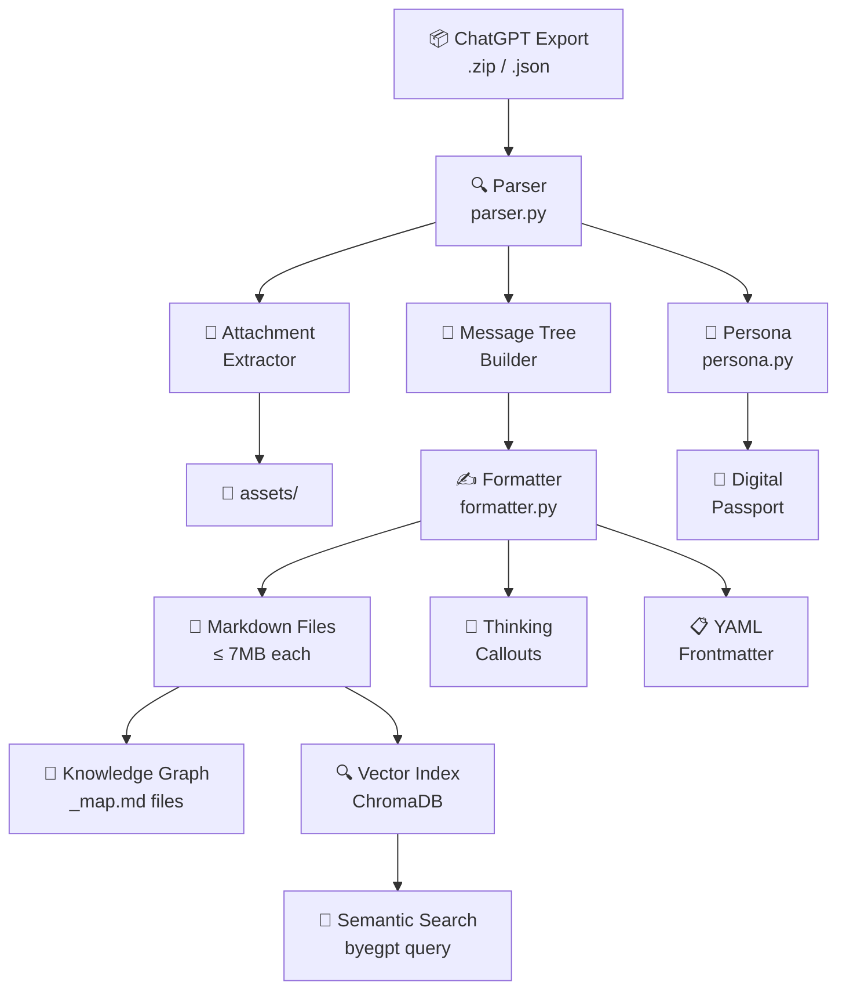
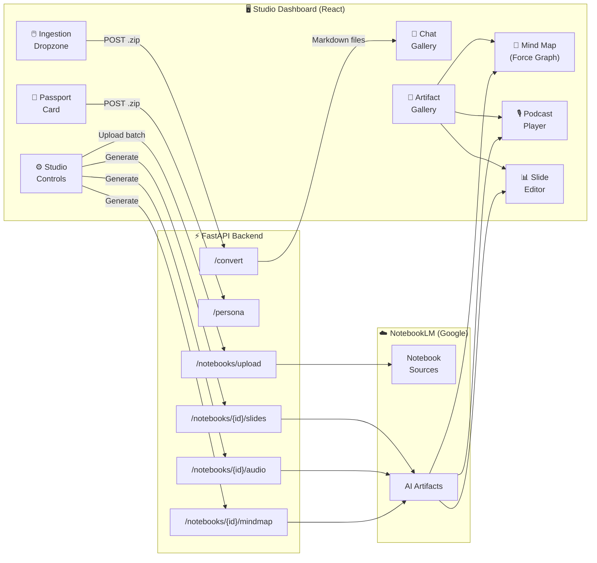

# 🚀 byeGPT Studio

> **Migrate your entire ChatGPT history to Gemini-optimized Markdown — in seconds.**
> *Now with a full-stack React dashboard, FastAPI backend, and direct NotebookLM integration.*

[](https://www.python.org/downloads/)
[](LICENSE)
[](https://github.com/damie/byegpt/actions)
[](docker-compose.yml)

---

## Why byeGPT?

Your conversation history is a goldmine. Whether you just want a quick backup to throw into NotebookLM or you want to build a fully searchable local knowledge base, **byeGPT** has you covered. It converts your raw, messy ChatGPT data export into perfectly-sized Markdown files.

| Problem | byeGPT Solution |
|---|---|
| Gemini/NotebookLM has file size limits | Auto-splits into perfectly-sized chunks (e.g., ~7MB) |
| ChatGPT exports are raw JSON blobs | Converts to clean, readable Markdown |
| Finding old conversations is impossible | Optional **Semantic Search** with local vector indexing |
| Hard to visualize your knowledge | **Interactive Mind Map** rendered directly in the browser |
| Thinking blocks (O1/GPT-5) clutter the output | Collapsed Obsidian callouts keep it clean |
| Attachments are scattered | Extracted & linked with proper relative paths |
| You want AI to "know you" instantly | **Digital Passport** — one click to copy your AI persona to clipboard |
| Managing notebooks is tedious | **Studio Dashboard** batch-uploads to NotebookLM automatically |
| Audio Overviews are hard to find | Built-in **Podcast Player** with play/pause controls |
| Slides need iteration | **Slide Editor** with per-slide AI revision prompts |

---

## 🛤️ Three Ways to Use byeGPT

### Use Case A: The Quick Migration (for NotebookLM / Gemini)
*You just want your chat history in a format that NotebookLM or Gemini Advanced can easily read without hitting file-size limits.*

1. Run `byegpt convert` and it instantly turns your `.zip` export into clean Markdown chunks in `./gemini_history/`.
2. Upload the folder directly to NotebookLM as a source.
3. Automatically get a `digital_passport.md` to give Gemini or NotebookLM instant context on who you are.

### Use Case B: The Intelligence Layer (for Obsidian / Local RAG)
*You want to build a local, searchable "second brain" out of your AI conversations.*

1. Run `byegpt convert --organize` to interactively sort your history into topic subfolders.
2. byeGPT generates Maps of Content (`_map.md`) so you can visually click through your history in Obsidian.
3. Run `byegpt index` to embed your history locally using ChromaDB.
4. Run `byegpt query "What did we discuss about python decorators?"` to instantly find answers from your past.

### Use Case C: The Studio Dashboard (v3 — full visual experience) 🆕
*You want a point-and-click interface that handles everything — conversion, NotebookLM upload, and AI artifact generation — without touching the terminal.*

1. Start the Studio with `docker compose up` and open `http://127.0.0.1:5173` (use `http://localhost:5173` only if it resolves correctly on your machine).
2. By default the Docker stack runs in demo mode for easy local testing.
3. For real NotebookLM mode, start the stack with `BYEGPT_DEMO_MODE=false docker compose up`.
2. Drag-and-drop your `.zip` export onto the **Ingestion Dropzone** — conversion starts immediately.
3. Click **Generate Digital Passport** to synthesize your AI persona, then copy it to the clipboard with one click.
4. Use the **Studio Controls** sidebar to batch-upload your Markdown files to NotebookLM, then generate a mind map, audio overview, or slide deck directly from the dashboard.

---

## ⚡ Quick Start

### CLI (v2 — no dependencies beyond Python)

```bash
# Clone the repository
git clone https://github.com/damie/byegpt.git
cd byegpt

# Install (editable mode)
pip install -e .

# Optional: Install Intelligence Layer dependencies (for RAG/Search)
pip install chromadb==0.4.15 sentence-transformers transformers

# Convert instantly — byeGPT auto-detects your export .zip!
byegpt convert

# Generate your Digital Passport
byegpt persona
```

Your files land in `./gemini_history/`, ready for NotebookLM, Gemini, or Obsidian.

### Studio Dashboard (v3 — Docker, recommended) 🆕

```bash
git clone https://github.com/damie/byegpt.git
cd byegpt
docker compose up --build
```

| Service | URL |
|---|---|
| Studio Dashboard (React) | http://127.0.0.1:5173 |
| Backend API + Swagger docs | http://127.0.0.1:8000/docs |

---

## ✨ Features

### CLI Features
- 📦 **ZIP & JSON support** — Feed it `.zip` or `conversations.json` directly
- ✨ **Zero-config auto-detect** — Automatically finds your export file in the current folder
- 📏 **Smart splitting** — Files respect Gemini's ~7MB context window (configurable)
- 📎 **Attachment extraction** — Images extracted to `assets/` with relative Markdown links
- 💭 **Thinking blocks** — GPT-5/O1 reasoning rendered as collapsed Obsidian callouts
- 📋 **YAML frontmatter** — Title, date, model, tags — searchable in Obsidian/Logseq
- 🧬 **Code blocks** — Properly fenced with language tags
- 🛂 **Digital Passport** — AI profile document capturing your communication style
- 🎨 **Beautiful CLI** — Rich progress bars, spinners, and colorful output
- 🧭 **Knowledge Graph** — Automatically generates Map of Content (MOC) files for Obsidian
- 🔍 **Semantic Search** — Local vector indexing with ChromaDB for natural language retrieval
- 📂 **Topic Organizer** — Interactively categorize history into topic subfolders

### Studio Dashboard Features (v3) 🆕
- 🖱️ **Drag-and-drop ingestion** — Drop your `.zip` directly; real-time conversion stats appear instantly
- 🛂 **Digital Passport card** — One-click AI persona generation with clipboard copy
- 📁 **Converted file gallery** — Scrollable grid of every generated Markdown file
- ☁️ **NotebookLM batch uploader** — Auto-chunks files into 50-source batches and creates notebooks
- 🧠 **Interactive Mind Map** — Force-directed graph (powered by `react-force-graph-2d`) visualises your knowledge connections; node labels and group colours update in real time
- 🎙️ **Podcast Player** — Built-in audio player with play/pause for NotebookLM Audio Overviews
- 📊 **Slide Editor** — Expandable slide list where each slide has an AI revision prompt input — type a prompt and press Enter (or click Send) to regenerate that slide via the Gemini API

---

## 📖 CLI Reference

### `byegpt convert`

```bash
byegpt convert [OPTIONS]
```

| Option | Default | Description |
|---|---|---|
| `--input`, `-i` | *(auto)* | Path to `.zip` or `conversations.json` |
| `--output`, `-o` | `./gemini_history` | Output folder for Markdown files |
| `--organize` | `false` | Interactively organize into topic subfolders |
| `--split-size`, `-s` | `7MB` | Max file size per Markdown file |
| `--no-thinking` | `false` | Exclude thinking/reasoning blocks |
| `--no-attachments` | `false` | Skip attachment extraction |

### `byegpt persona`

```bash
byegpt persona [OPTIONS]
```

| Option | Default | Description |
|---|---|---|
| `--input`, `-i` | *(required)* | Path to `.zip` or `conversations.json` |
| `--output`, `-o` | `./digital_passport.md` | Output file path |

### `byegpt index`
Index your Markdown history for semantic search.

```bash
byegpt index [OPTIONS]
```

| Option | Default | Description |
|---|---|---|
| `--input`, `-i` | `./gemini_history` | Folder containing Markdown files to index |
| `--db`, `-d` | `.byegpt/index` | Path to store the vector database index |
| `--limit`, `-l` | `None` | Limit indexing to the first N files (for quick testing) |
| `--batch-size`, `-b` | `200` | Number of conversations to batch per database addition |

> [!TIP]
> You can index a specific topic by pointing `--input` to a subfolder:
> `byegpt index --input ./gemini_history/Python`

### `byegpt query`
Perform a semantic search across your indexed history.

```bash
byegpt query [TEXT] [OPTIONS]
```

| Option | Default | Description |
|---|---|---|
| `--db`, `-d` | `.byegpt/index` | Path to the vector database index |
| `--results`, `-n` | `5` | Number of results to return |

### General

```bash
byegpt --version    # Show version
byegpt --help       # Show help
```

---

## 🧭 Data Flow

### CLI (v2)



### Studio Dashboard (v3)



---

## 🖥️ Studio Dashboard — Visual Features

The Studio Dashboard is a dark-themed React application (Tailwind + Vite) that guides you through a 4-step workflow using a **two-column layout**:

```
┌─────────────────────────── byeGPT Studio ───────────────────────────────┐
│                                                                          │
│  ┌────────────── Main (2/3 width) ──────────────┐  ┌── Sidebar (1/3) ──┐│
│  │                                               │  │                   ││
│  │  ① Import your ChatGPT export                │  │  Studio Controls  ││
│  │  ┌─────────────────────────────────────────┐ │  │  ┌─────────────┐  ││
│  │  │   📦  Drop your ChatGPT export here     │ │  │  │ 1 · Upload  │  ││
│  │  │   Accepts .zip or conversations.json    │ │  │  │   to NLM    │  ││
│  │  └─────────────────────────────────────────┘ │  │  └─────────────┘  ││
│  │                                               │  │  ┌─────────────┐  ││
│  │  ② Digital Passport                          │  │  │ 2 · Generate│  ││
│  │  ┌─────────────────────────────────────────┐ │  │  │  Artifacts  │  ││
│  │  │  👤  Generate Digital Passport           │ │  │  │  🧠 Mind Map│  ││
│  │  │  [ Sync Persona as Global Context 📋 ]  │ │  │  │  🎙️ Audio   │  ││
│  │  └─────────────────────────────────────────┘ │  │  │  📊 Slides  │  ││
│  │                                               │  │  └─────────────┘  ││
│  │  ③ Converted Files                           │  │                   ││
│  │  ┌──────┐ ┌──────┐ ┌──────┐ ┌──────┐        │  │                   ││
│  │  │ 📄   │ │ 📄   │ │ 📄   │ │ 📄   │ …      │  │                   ││
│  │  └──────┘ └──────┘ └──────┘ └──────┘        │  │                   ││
│  │                                               │  │                   ││
│  │  ④ Artifacts                                 │  │                   ││
│  │  ┌─────────────────────────────────────────┐ │  │                   ││
│  │  │  🧠 Mind Map  [force-directed graph]     │ │  │                   ││
│  │  │  🎙️ Audio Overview  [▶ player bar]       │ │  │                   ││
│  │  │  📊 Slides  [expandable list + prompts]  │ │  │                   ││
│  │  └─────────────────────────────────────────┘ │  │                   ││
│  └───────────────────────────────────────────────┘  └───────────────────┘│
└──────────────────────────────────────────────────────────────────────────┘
```

### 🖱️ Ingestion Dropzone (`IngestionDropzone`)

The entry point of the Studio. Drop your ChatGPT `.zip` or `conversations.json` directly onto the dropzone — or click to open a file picker.

- **Idle state**: shows a file-archive icon with a dashed border that glows teal on hover/drag-over
- **Converting state**: border dims, a pulsing progress bar appears, and the label changes to "Converting…"
- **Done state**: a green checkmark appears alongside three stat tiles showing the number of **Conversations**, **Files created**, and **Attachments** extracted
- **Error state**: a red alert icon with the error message from the backend

### 🛂 Digital Passport Card (`PassportCard`)

Triggered after your file is uploaded. Click **Generate Digital Passport** to call the `/persona` API — the backend analyses all your user messages and returns a structured Markdown document.

- The first ~600 characters of the passport are previewed in a scrollable code block
- A **"Sync Persona as Global Context"** button copies the full Markdown to your clipboard so you can paste it into any AI assistant (Gemini, ChatGPT, Claude…)
- The button briefly shows a green checkmark and "Copied!" confirmation

### 📁 Chat Gallery (`ChatGallery`)

A scrollable 2-column grid of every `.md` file produced by the conversion. Each card shows the filename with a document icon, truncated to fit. Lets you quickly see the scope of your archive at a glance.

### ⚙️ Studio Controls (`StudioControls`)

A sticky sidebar panel divided into two sections:

**Section 1 — Upload to NotebookLM**
- A text input to name the notebook (defaults to `"byeGPT Archive"`)
- An **Upload to NotebookLM** button that posts the output directory to `/notebooks/upload`; the backend automatically splits files into batches of 50 (NotebookLM's source limit) and creates one notebook per batch
- A confirmation badge showing how many notebooks were created

**Section 2 — Generate Artifacts** *(appears once notebooks exist)*
- If multiple notebooks were created, a dropdown lets you select which one to target
- Three action buttons, each with a loading spinner while the request is in-flight:
  - 🧠 **Generate Mind Map** — triggers `/notebooks/{id}/mindmap`
  - 🎙️ **Generate Audio Overview** — triggers `/notebooks/{id}/audio`
  - 📊 **Generate Slides** — triggers `/notebooks/{id}/slides`

### 🧠 Mind Map (`MindMap`)

An interactive, physics-based force graph powered by **`react-force-graph-2d`** (rendered on an HTML canvas).

- Nodes represent knowledge concepts; edges represent connections between them
- Node labels are rendered in teal (`#14b8a6`) on a near-black canvas (`#03050a`)
- The graph is fully interactive: nodes can be dragged, and the simulation settles automatically
- A header bar shows the **node count** and **link count**
- **Graceful fallback**: if `react-force-graph-2d` fails to load (e.g., in SSR), a plain accessible table listing all nodes and their groups is shown instead

### 🎙️ Podcast Player (`PodcastPlayer`)

A minimal audio player for NotebookLM's "Audio Overview" MP3 feature, embedded directly inside the Artifact Gallery.

- A circular **play/pause** button (teal background, white icon) toggles playback
- A thin progress track shows the playback position (updating via the `<audio>` element)
- The `onEnded` event resets the button back to the play state automatically

### 📊 Slide Editor (`SlideEditor`)

An expandable accordion list of the AI-generated presentation slides.

- Each slide row shows the slide number and title; clicking it toggles the content panel open/closed using a chevron icon
- The expanded panel shows the **slide body text** and a **revision prompt input**:
  - Type a prompt (e.g., *"Make this slide about Python decorators more visual"*)
  - Press **Enter** or click the **Send** button (→) to call `PATCH /notebooks/{id}/slides/{index}` and update that individual slide in place
- The slide list updates reactively as revisions come back from the API

---

## 🛂 Digital Passport

The `persona` command (and the **Digital Passport Card** in the Studio) analyses your entire ChatGPT history and generates a structured document capturing:

- **📊 Profile Summary** — Total conversations, messages, date range
- **🏷️ Top Topics** — Your most discussed subjects
- **🤖 Models Used** — Which AI models you've used
- **📅 Activity Timeline** — Monthly conversation frequency
- **💬 Communication Style** — Message length, question ratio, style primer

In the Studio Dashboard the passport is previewed directly in the card and can be copied to the clipboard with a single click. On the CLI it writes to `./digital_passport.md`.

> Share this document with any AI assistant and it'll understand your preferences and communication style instantly!

---

## 📄 Output Format

Each generated Markdown file includes:

```markdown
---
title: "My Conversation Title"
date: 2024-03-10
model: gpt-4o
tags: [chatgpt-export, archive]
---

# My Conversation Title (2024-03-10)

**USER:**
What is the meaning of life?

**ASSISTANT:**
The meaning of life is a philosophical question...

> [!abstract]- 💭 Thinking Process
> Let me consider this from multiple angles...
> First, from a philosophical standpoint...
```

Context Anchor comments (injected by the Studio backend for NotebookLM citation) appear at the very top of each file:

```markdown
<!-- source: https://chatgpt.com/c/abc123def456 -->
---
title: "My Conversation Title"
...
```

---

## 🏗️ v3 Studio — Architecture Reference

### 📂 Repository Structure

```
byegpt/
├── .byegpt/                # Local cache & session storage
├── assets/                 # Extracted images from ChatGPT
├── backend/                # FastAPI & NotebookLM integration
│   ├── app/
│   │   ├── main.py         # Entry point & 10 API routes
│   │   ├── cloud.py        # notebooklm-py batch uploader + artifact wrappers
│   │   ├── parser.py       # Markdown conversion + Context Anchor injection
│   │   └── auth_manager.py # Playwright headless login & cookie persistence
│   ├── requirements.txt
│   └── Dockerfile          # python:3.11-slim + Playwright/Chromium
├── frontend/               # React 18 + Tailwind CSS + Vite
│   ├── src/
│   │   ├── components/
│   │   │   ├── IngestionDropzone.tsx  # Drag-and-drop upload + live stats
│   │   │   ├── PassportCard.tsx       # Persona preview + clipboard sync
│   │   │   ├── ChatGallery.tsx        # Converted file grid
│   │   │   ├── StudioControls.tsx     # NotebookLM action sidebar
│   │   │   ├── MindMap.tsx            # Force-graph canvas (react-force-graph-2d)
│   │   │   └── ArtifactGallery.tsx   # MindMap + PodcastPlayer + SlideEditor
│   │   ├── hooks/
│   │   │   └── useNotebook.ts        # API calls: upload, mindmap, audio, slides
│   │   └── App.tsx                   # 4-step layout (2-column grid)
│   ├── package.json
│   └── tailwind.config.js
├── core/                   # Shared CLI logic (dependency-free wrappers)
│   ├── converter.py        # convert_conversations() — no Typer/Rich coupling
│   └── persona.py          # build_passport()
├── skill.json              # Claude / Codex agent integration descriptor
├── docker-compose.yml      # Backend + Frontend + named node_modules volume
└── README.md
```

### 🛠️ Local Development

**Backend:**
```bash
cd backend
pip install -r requirements.txt
playwright install chromium
uvicorn app.main:app --reload
# API docs → http://localhost:8000/docs
```

**Frontend:**
```bash
cd frontend
npm install
npm run dev
# Studio → http://localhost:5173
```

Vite proxies `/api/*` → `http://localhost:8000` so the React dev-server and the FastAPI backend talk to each other without CORS issues.

### 🔑 First-Run Authentication

The Studio requires a Google account to use the NotebookLM features. On first launch:

1. Call `POST /auth/login` (or click the login button in the UI once implemented)
2. A headed Chromium window opens — complete the Google sign-in
3. The session cookies are saved to `.byegpt/storage.json` and reused on all future requests
4. `GET /auth/status` returns `{"authenticated": true}` once cookies are stored

### 🤖 Agent Integration (`skill.json`)

The included `skill.json` lets Claude Code or Codex talk directly to your byeGPT PowerApp:

```
"Claude, ask my byeGPT archive about that recipe I saved in 2023."
```

Load the skill in Claude Code:
```bash
claude skill add ./skill.json
```

### 🗺️ Backend API Routes

| Method | Path | What the Studio uses it for |
|---|---|---|
| `GET` | `/health` | Liveness probe |
| `GET` | `/auth/status` | Check if Google session cookie exists |
| `POST` | `/auth/login` | Start headless Playwright Google login |
| `POST` | `/convert` | **IngestionDropzone** → Markdown + Context Anchors |
| `POST` | `/persona` | **PassportCard** → Digital Passport Markdown |
| `POST` | `/notebooks/upload` | **StudioControls** → batch upload to NotebookLM |
| `GET` | `/notebooks/{id}/mindmap` | **StudioControls** → force-graph JSON for MindMap |
| `GET` | `/notebooks/{id}/audio` | **StudioControls** → MP3 for PodcastPlayer |
| `GET` | `/notebooks/{id}/slides` | **StudioControls** → slide list for SlideEditor |
| `PATCH` | `/notebooks/{id}/slides/{i}` | **SlideEditor** revision prompt → updated slide |

---

## 🧪 Development

```bash
# Install CLI with dev dependencies
pip install -e ".[dev]"

# Run tests
pytest tests/ -v

# Run with coverage
pytest tests/ -v --cov=byegpt --cov-report=term-missing
```

---

## 🤝 Contributing

Contributions are welcome! Please:

1. Fork the repository
2. Create a feature branch (`git checkout -b feature/amazing-feature`)
3. Run tests (`pytest tests/ -v`)
4. Commit your changes
5. Open a Pull Request

---

## 📜 License

MIT — see [LICENSE](LICENSE) for details.

---

<p align="center">
  Made with ❤️ for everyone building a personal AI knowledge base<br/>
  <sub>byeGPT v3.0.0 "Studio"</sub>
</p>
### Real NotebookLM Mode

The Docker stack defaults to demo mode because interactive Google login from inside a Linux container is unreliable on non-X11 hosts.

To use real NotebookLM:

```bash
BYEGPT_DEMO_MODE=false docker compose up --build
```

Then use one of these two paths:

1. Recommended: place a valid Playwright session file at `.byegpt/storage.json` before opening the dashboard.
2. Alternative: run the backend on the host OS instead of Docker, complete `/auth/login` there, and let it write `.byegpt/storage.json`.

If you run in real mode without a valid session file, NotebookLM actions will return:

```text
Interactive NotebookLM login is unavailable in Docker without an X server.
```

That is expected in containerized mode on many Windows/macOS setups.

### Create `.byegpt/storage.json` On The Host

If you want a real NotebookLM session without fighting the Docker browser limitation, run the backend on the host once:

Windows:

```powershell
.\scripts\start_host_backend.ps1
```

Or:

```cmd
scripts\start_host_backend.cmd
```

macOS / Linux / WSL:

```bash
./scripts/start_host_backend.sh
```

What the script does:

1. Creates `.venv-backend`
2. Installs `backend/requirements.txt`
3. Installs Playwright Chromium
4. Starts the backend in real mode on `http://127.0.0.1:8000`

Then:

1. Open `http://127.0.0.1:8000/docs`
2. Run `POST /auth/login`
3. Complete the Google / NotebookLM sign-in in the browser window
4. Confirm `.byegpt/storage.json` now exists
5. Stop the host backend
6. Start Docker in real mode:

```bash
BYEGPT_DEMO_MODE=false docker compose up --build
```

The Docker backend will reuse `.byegpt/storage.json`.

### If Google Rejects The Playwright Login

Google may reject even a real Chrome instance when Playwright launches it.

If that happens, use Chrome manually and capture the session instead:

1. Start Chrome with remote debugging:

```powershell
.\scripts\start_chrome_debug.ps1
```

2. In that Chrome window, sign in to NotebookLM manually and make sure it works.
3. In a second terminal, capture the session into `.byegpt/storage.json`:

```powershell
.\scripts\capture_chrome_session.ps1
```

4. Press Enter in the capture terminal after NotebookLM is open in Chrome.
5. Start Docker in real mode:

```bash
BYEGPT_DEMO_MODE=false docker compose up --build
```

This path avoids automating the Google sign-in itself.
