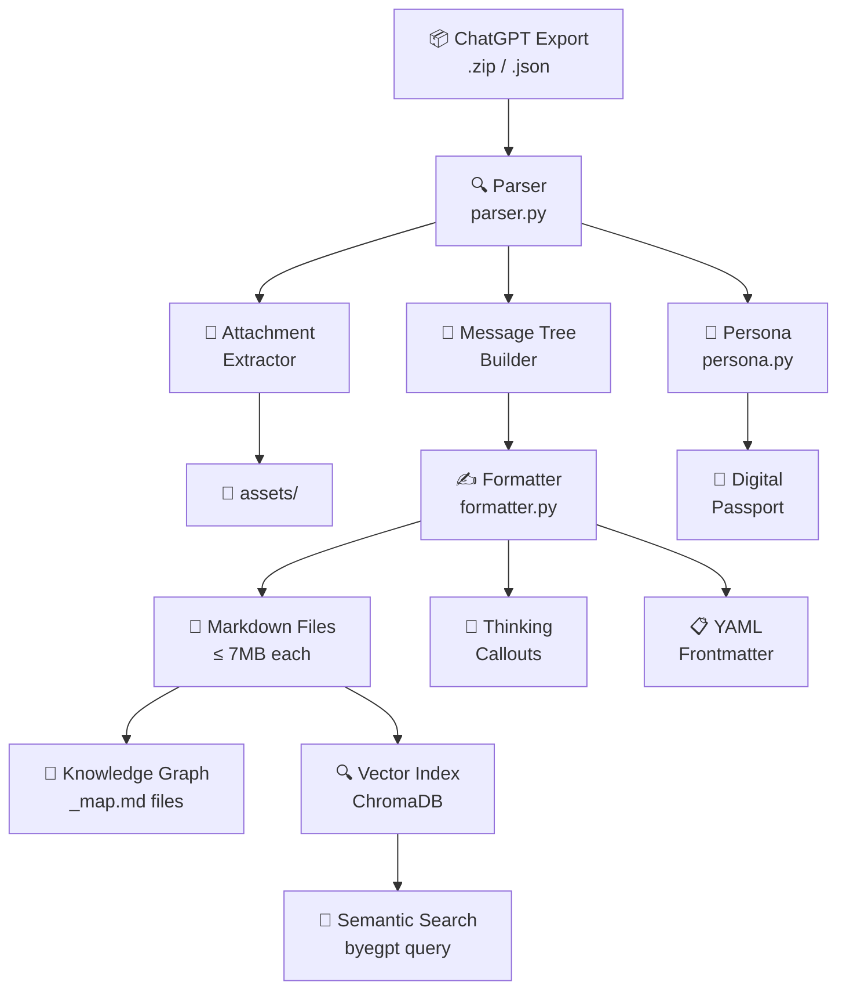

# 🚀 byeGPT

> **Migrate your entire ChatGPT history to Gemini-optimized Markdown — in seconds.**
> *Plus: transform it into a searchable, intelligent knowledge base optimized for NotebookLM, Obsidian, and Local RAG.*

[](https://www.python.org/downloads/)
[](LICENSE)
[](https://github.com/damie/byegpt/actions)

---

## Why byeGPT?

Your conversation history is a goldmine. Whether you just want a quick backup to throw into NotebookLM or you want to build a fully searchable local knowledge base, **byeGPT** has you covered. It converts your raw, messy ChatGPT data export into perfectly-sized Markdown files.

| Problem | byeGPT Solution |
|---|---|
| Gemini/NotebookLM has file size limits | Auto-splits into perfectly-sized chunks (e.g., ~7MB) |
| ChatGPT exports are raw JSON blobs | Converts to clean, readable Markdown |
| Finding old conversations is impossible | Optional **Semantic Search** with local vector indexing |
| Hard to visualize your knowledge | Automatically builds **Obsidian Knowledge Graphs** (MOCs) |
| Thinking blocks (O1/GPT-5) clutter the output | Collapsed Obsidian callouts keep it clean |
| Attachments are scattered | Extracted & linked with proper relative paths |
| You want AI to "know you" instantly | **Digital Passport** synthesizes your AI communication profile |

---

## 🛤️ Two Ways to Use byeGPT

### Use Case A: The Quick Migration (for NotebookLM / Gemini)
*You just want your chat history in a format that NotebookLM or Gemini Advanced can easily read without hitting file-size limits.*

1. Run `byegpt convert` and it instantly turns your `.zip` export into clean Markdown chunks in `./gemini_history/`.
2. Upload the folder directly to NotebookLM as a source.
3. Automatically get a `digital_passport.md` to give Gemini or NotebookLM instant context on who you are.

### Use Case B: The Intelligence Layer (for Obsidian / Local RAG)
*You want to build a local, searchable "second brain" out of your AI conversations.*

1. Run `byegpt convert --organize` to interactively sort your history into topic subfolders.
2. byeGPT generates Maps of Content (`_map.md`) so you can visually click through your history in Obsidian.
3. Run `byegpt index` to embed your history locally using ChromaDB.
4. Run `byegpt query "What did we discuss about python decorators?"` to instantly find answers from your past.

---

## ⚡ Quick Start

### 1. Install

```bash
# Clone the repository
git clone https://github.com/damie/byegpt.git
cd byegpt

# Install (editable mode)
pip install -e .

# Optional: Install Intelligence Layer dependencies (for RAG/Search)
pip install chromadb==0.4.15 sentence-transformers transformers
```

### 2. Export your ChatGPT data

Go to [ChatGPT Settings → Data Controls → Export Data](https://chatgpt.com/#settings/DataControls). You'll receive a `.zip` file via email.

### 3. Run it

```bash
# Convert instantly — byeGPT auto-detects your export .zip!
byegpt convert

# Generate your Digital Passport
byegpt persona
```

That's it! Your files are in `./gemini_history/`, ready for NotebookLM, Gemini, or Obsidian.

---

## ✨ Features

- 🧠 **Intelligence Layer** — Turn your static archive into an active knowledge base
    - 🧭 **Knowledge Graph** — Automatically generates Map of Content (MOC) files for visual navigation in Obsidian
    - 🔍 **Semantic Search** — Local vector indexing with ChromaDB for natural language history retrieval
- 📂 **Topic Organizer** — Interactively categorize your history into subfolders based on your top AI topics
- 📦 **ZIP & JSON support** — Feed it `.zip` or `conversations.json` directly
- ✨ **Zero-config auto-detect** — Automatically finds your export file in the current folder
- 📏 **Smart splitting** — Files respect Gemini's ~7MB context window (configurable)
- 📎 **Attachment extraction** — Images extracted to `assets/` with relative Markdown links
- 💭 **Thinking blocks** — GPT-5/O1 reasoning rendered as collapsed Obsidian callouts
- 📋 **YAML frontmatter** — Title, date, model, tags — searchable in Obsidian/Logseq
- 🧬 **Code blocks** — Properly fenced with language tags
- 📊 **Execution output** — Preserved in labeled code blocks
- 🛂 **Digital Passport** — AI profile document capturing your communication style
- 🎨 **Beautiful CLI** — Rich progress bars, spinners, and colorful output

---

## 📖 CLI Reference

### `byegpt convert`

```bash
byegpt convert [OPTIONS]
```

| Option | Default | Description |
|---|---|---|
| `--input`, `-i` | *(auto)* | Path to `.zip` or `conversations.json` |
| `--output`, `-o` | `./gemini_history` | Output folder for Markdown files |
| `--organize` | `false` | Interactively organize into topic subfolders |
| `--split-size`, `-s` | `7MB` | Max file size per Markdown file |
| `--no-thinking` | `false` | Exclude thinking/reasoning blocks |
| `--no-attachments` | `false` | Skip attachment extraction |

### `byegpt persona`

```bash
byegpt persona [OPTIONS]
```

| Option | Default | Description |
|---|---|---|
| `--input`, `-i` | *(required)* | Path to `.zip` or `conversations.json` |
| `--output`, `-o` | `./digital_passport.md` | Output file path |

### `byegpt index`
Index your Markdown history for semantic search.

```bash
byegpt index [OPTIONS]
```

| Option | Default | Description |
|---|---|---|
| `--input`, `-i` | `./gemini_history` | Folder containing Markdown files to index |
| `--db`, `-d` | `.byegpt/index` | Path to store the vector database index |
| `--limit`, `-l` | `None` | Limit indexing to the first N files (for quick testing) |
| `--batch-size`, `-b` | `200` | Number of conversations to batch per database addition |

> [!TIP]
> You can index a specific topic by pointing `--input` to a subfolder:
> `byegpt index --input ./gemini_history/Python`

### `byegpt query`
Perform a semantic search across your indexed history.

```bash
byegpt query [TEXT] [OPTIONS]
```

| Option | Default | Description |
|---|---|---|
| `--db`, `-d` | `.byegpt/index` | Path to the vector database index |
| `--results`, `-n` | `5` | Number of results to return |

### General

```bash
byegpt --version    # Show version
byegpt --help       # Show help
```

---

## 🧭 Data Flow



---

## 🛂 Digital Passport

The `persona` command analyzes your entire ChatGPT history and generates a **Digital Passport** — a structured document capturing:

- **📊 Profile Summary** — Total conversations, messages, date range
- **🏷️ Top Topics** — Your most discussed subjects
- **🤖 Models Used** — Which AI models you've used
- **📅 Activity Timeline** — Monthly conversation frequency
- **💬 Communication Style** — Message length, question ratio, style primer

> Share this document with Gemini and it'll understand your preferences instantly!

---

## 🧪 Development

```bash
# Install with dev dependencies
pip install -e ".[dev]"

# Run tests
pytest tests/ -v

# Run with coverage
pytest tests/ -v --cov=byegpt --cov-report=term-missing
```

---

## 📄 Output Format

Each generated Markdown file includes:

```markdown
---
title: "My Conversation Title"
date: 2024-03-10
model: gpt-4o
tags: [chatgpt-export, archive]
---

# My Conversation Title (2024-03-10)

**USER:**
What is the meaning of life?

**ASSISTANT:**
The meaning of life is a philosophical question...

> [!abstract]- 💭 Thinking Process
> Let me consider this from multiple angles...
> First, from a philosophical standpoint...
```

---

## 🤝 Contributing

Contributions are welcome! Please:

1. Fork the repository
2. Create a feature branch (`git checkout -b feature/amazing-feature`)
3. Run tests (`pytest tests/ -v`)
4. Commit your changes
5. Open a Pull Request

---

## 📜 License

MIT — see [LICENSE](LICENSE) for details.

---

<p align="center">
  Made with ❤️ for everyone building a personal AI knowledge base<br/>
  <sub>byeGPT v2.0.0</sub>
</p>
